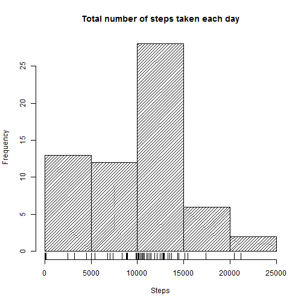
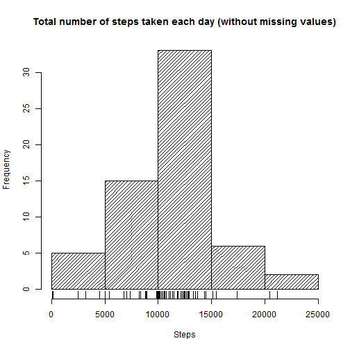

## Loading and preprocessing data

We set the working directory for knitr **"~/Reproducible Research"** and we download there the dataset


```r
if (file.exists("./activity.zip")) { unzip("./activity.zip") }
if (file.exists("./activity.csv")) 
{ 
        activity <- read.csv("./activity.csv") 
}
unlink("./activity.csv")
activity <- transform(activity, date = as.Date(date, "%Y-%m-%d"))
str(activity)
```

```
## 'data.frame':	17568 obs. of  3 variables:
##  $ steps   : int  NA NA NA NA NA NA NA NA NA NA ...
##  $ date    : Date, format: "2012-10-01" "2012-10-01" ...
##  $ interval: int  0 5 10 15 20 25 30 35 40 45 ...
```

```r
head(activity)
```

```
##   steps       date interval
## 1    NA 2012-10-01        0
## 2    NA 2012-10-01        5
## 3    NA 2012-10-01       10
## 4    NA 2012-10-01       15
## 5    NA 2012-10-01       20
## 6    NA 2012-10-01       25
```

## What is mean total number of steps taken per day?

* Firsly we calculate the total number steps taken per day (missing values will be excluded in the sum)


```r
TotalStepsPerDay <- with(activity, tapply(steps, date, sum, na.rm=TRUE))
```

* Then we make a histogram of the total number of steps taken each day


```r
hist(TotalStepsPerDay, density=20, main="Total number of steps taken each day", xlab="Steps")
rug(TotalStepsPerDay)
```



* And we calculate the **mean** and **median** of the total number of steps taken per day


```r
summary(TotalStepsPerDay, digits=7)
```

```
##     Min.  1st Qu.   Median     Mean  3rd Qu.     Max. 
##     0.00  6778.00 10395.00  9354.23 12811.00 21194.00
```

```r
mean(TotalStepsPerDay)
```

```
## [1] 9354.23
```

```r
median(TotalStepsPerDay)
```

```
## [1] 10395
```

## What is the average daily activity pattern?

* Make a time series plot (i.e. type = "l") of the 5-minute interval (x-axis) and the average number of steps taken, averaged across all days (y-axis)


```r
Average.AllDays <- aggregate(steps~interval, data=activity, FUN=mean)
plot(Average.AllDays, type="l", ylab="Average number of steps taken across all days", xlab="5-minute interval")
```


* Which 5-minute interval, on average across all the days in the dataset, contains the maximum number of steps?


```r
Average.AllDays[which.max(Average.AllDays$steps),]
```

```
##     interval    steps
## 104      835 206.1698
```

## Imputing missing values

Note that there are a number of days/intervals where there are missing values (coded as **NA**). The presence of missing days may introduce bias into some calculations or summaries of the data.

* Calculate and report the total number of missing values in the dataset (i.e. the total number of rows with **NAs**)


```r
missingvalues <- activity[which(is.na(activity$steps)),]
withoutmissingvalues <- activity[which(!is.na(activity$steps)),]
nrow(missingvalues)
```

```
## [1] 2304
```

* The strategy for filling in all of the missing values in the dataset is to replace them by the mean that 5-minute interval accross all the same weekday. 


```r
# Add weekday column to dataset without missing values
library(lubridate)
withoutmissingvalues$weekday <- wday(withoutmissingvalues$date)
# Calculate the average steps per interval and weekday for dataset without missing values
Average.WeekDays <- aggregate(steps~interval+weekday, data=withoutmissingvalues, FUN=mean)
head(Average.WeekDays)
```

```
##   interval weekday    steps
## 1        0       1 0.000000
## 2        5       1 0.000000
## 3       10       1 0.000000
## 4       15       1 0.000000
## 5       20       1 0.000000
## 6       25       1 7.428571
```

* Create a new dataset that is equal to the original dataset but with the missing data filled in.


```r
# Add weekday column to missing values dataset
missingvalues$weekday <- wday(missingvalues$date)
# Merge missing values with average steps per interval and weekday
filled.navalues <- merge(missingvalues, Average.WeekDays, by=c("interval","weekday"))
# Select only average data filled (steps.y column), date and inverval
filled.navalues <- subset(filled.navalues, select=c("steps.y","date","interval"))
# Rename steps.y column
names(filled.navalues)[names(filled.navalues)=="steps.y"] = "steps"
# Remove weekday column on withoutmissingvalues data set
withoutmissingvalues <- subset(withoutmissingvalues, select=c("steps","date","interval"))
# Bind rows from filled dataset and data set without missing values to create 
# new tidy dataset without missing values
tidy.activity <- rbind(withoutmissingvalues, filled.navalues)
str(tidy.activity)
```

```
## 'data.frame':	17568 obs. of  3 variables:
##  $ steps   : num  0 0 0 0 0 0 0 0 0 0 ...
##  $ date    : Date, format: "2012-10-02" "2012-10-02" ...
##  $ interval: int  0 5 10 15 20 25 30 35 40 45 ...
```

```r
head(tidy.activity)
```

```
##     steps       date interval
## 289     0 2012-10-02        0
## 290     0 2012-10-02        5
## 291     0 2012-10-02       10
## 292     0 2012-10-02       15
## 293     0 2012-10-02       20
## 294     0 2012-10-02       25
```

* Make a histogram of the total number of steps taken each day and calculate and report the **mean** and **median** total number of steps taken per day. 


```r
TotalStepsPerDay2 <- with(tidy.activity, tapply(steps, date, sum, na.rm=TRUE))
hist(TotalStepsPerDay2, density=20, main="Total number of steps taken each day (without missing values)", xlab="Steps")
rug(TotalStepsPerDay2)
```



* Calculate mean and median total number of steps taken per day


```r
summary(TotalStepsPerDay2, digits=7)
```

```
##     Min.  1st Qu.   Median     Mean  3rd Qu.     Max. 
##    41.00  8918.00 11015.00 10821.21 12811.00 21194.00
```

```r
mean(TotalStepsPerDay2)
```

```
## [1] 10821.21
```

```r
median(TotalStepsPerDay2)
```

```
## [1] 11015
```

* Do these values differ from the estimates from the first part of the assignment? What is the impact of imputing missing data on the estimates of the total daily number of steps?


```r
# mean difference of imputing missing data
mean(TotalStepsPerDay2) - mean(TotalStepsPerDay)
```

```
## [1] 1466.98
```

```r
# median difference of imputing missing data
median(TotalStepsPerDay2) - median(TotalStepsPerDay)
```

```
## [1] 620
```

* **Mean** and **median** calculated after imputing missing data are higher that the initial estimation ignoring the missing values. 

## Are there differences in activity patterns between weekdays and weekends?

* Create a new factor variable in the dataset with two levels - "weekday" and "weekend" indicating whether a given date is a weekday or weekend day. We use the dataset with the filled-in missing values for this part.


```r
# Add weekend column to dataset with "weekday" and "weekend" values
tidy.activity[which(!wday(tidy.activity$date) %in% c(7,1)),"weekday"] <- "weekday"
tidy.activity[which(wday(tidy.activity$date) %in% c(7,1)),"weekday"] <- "weekend"
tidy.activity$weekday <- as.factor(tidy.activity$weekday)
```

* Make a panel plot containing a time series plot (i.e.**type = "l"**) of the 5-minute interval (x-axis) and the average number of steps taken, averaged across all weekday days or weekend days (y-axis). 


```r
# Aggregate data per interval and weekend logical variable
AveragePerDayType <- aggregate(steps~interval+weekday, data=tidy.activity, FUN=mean)
# Plot panel with lattice to look like the sample plot
library(lattice)
xyplot(AveragePerDayType$steps ~ AveragePerDayType$interval | AveragePerDayType$weekday, 
       main="Average number of steps by day type (weekday or weekend)", 
       type="l", 
       layout=(c(1,2)), 
       ylab="Average number of steps taken across all days", 
       xlab="5-minute interval")
```


* We can see in above plot the different activity patterns for normal weekdays and weekend days.
